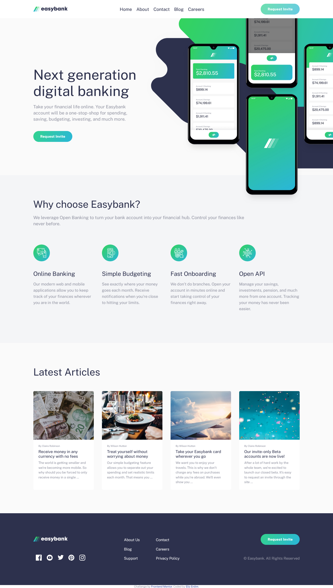

# Frontend Mentor - Easybank landing page solution

This is a solution to the [Easybank landing page challenge on Frontend Mentor](https://www.frontendmentor.io/challenges/easybank-landing-page-WaUhkoDN). Frontend Mentor challenges help you improve your coding skills by building realistic projects. 

## Table of contents

- [Overview](#overview)
  - [The challenge](#the-challenge)
  - [Screenshot](#screenshot)
  - [Links](#links)
- [My process](#my-process)
  - [Built with](#built-with)
  - [What I learned](#what-i-learned)
  - [Continued development](#continued-development)

## Overview

### The challenge

Users should be able to:

- View the optimal layout for the interface depending on their device's screen size
- See hover states for all interactive elements on the page

### Screenshot

### Links

- [View Code](https://github.com/elizerdim/easybank-landing-page)
- [Live Preview](https://elizerdim.github.io/easybank-landing-page/)

## My process

### Built with

- Semantic HTML5 markup
- CSS
- Flexbox
- CSS Grid
- Mobile-first workflow

### What I learned

- I didn't use BEM naming for this project and realized how it makes CSS much more manageable and understandable. I will be using BEM naming convention for future projects.

- &lt;small&gt; tag has a display of inline by default.

- overflow-x: hidden caused an automatic vertical scrollbar, and setting overflow-y: visible didn't work. I found the answer on this [stackoverflow entry](https://stackoverflow.com/a/6433475). "If you are using visible for either overflow-x or overflow-y and something other than visible for the other, the visible value is interpreted as auto."

### Continued development

I feel fairly confident in writing responsive code at this point and will focus more on JavaScript projects next.